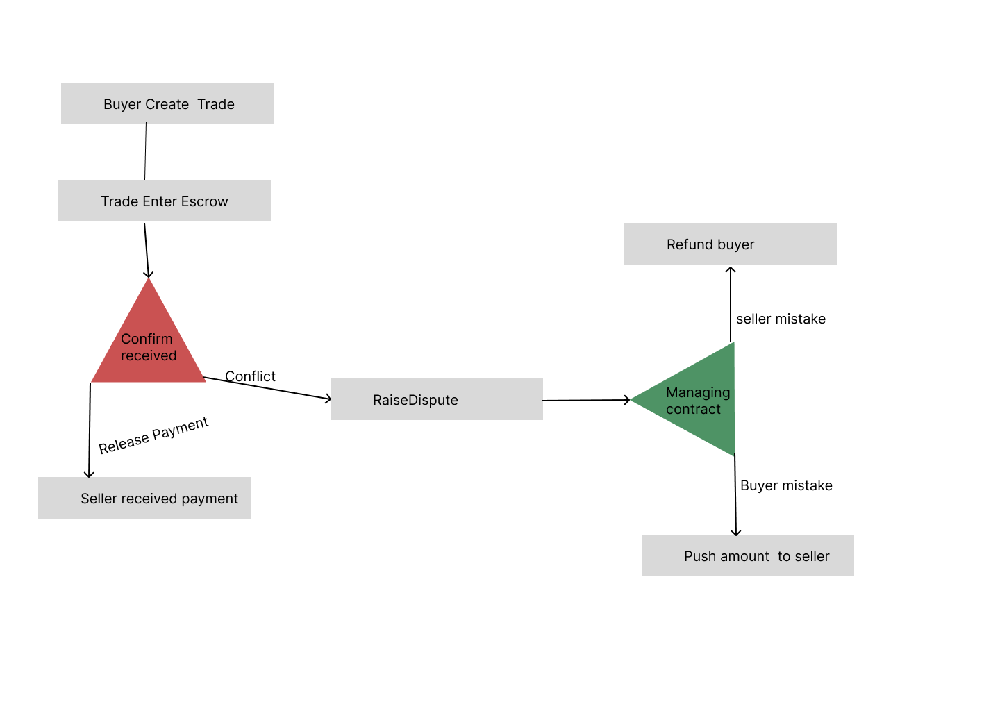

<!-- TITLE -->
<p align="center"> 
<h1>FUSION</h1>
    </a>
  </p>
</p>

<!-- TABLE OF CONTENTS -->

<details>
  <summary>Table of Contents</summary>
  <ol>
    <li>
      <a href="#about-the-project">About The Project</a>
      <ul>
        <li><a href="#built-with">Built With</a></li>
         <li><a href="#escrow-contract">Smart conract Escrow</a></li>
      </ul>
    </li>
    <li>
      <ul>
       <li><a href="#demo">Demo</a></li>
        <li><a href="#prerequisites">Prerequisites</a></li>
        <li><a href="#installation">Installation</a></li>
      </ul>
    </li>
    <li><a href="#usage">Usage</a></li>
    <li><a href="#roadmap">Roadmap</a></li>
    <li><a href="#contributing">Contributing</a></li>
    <li><a href="#license">License</a></li>
    <li><a href="#contact">Contact</a></li>
    <li><a href="#acknowledgments">Acknowledgments</a></li>
    
  </ol>
</details>

<!-- ABOUT THE PROJECT -->

## About The Project

Fusion is a decentralized application (dApp) designed to revolutionize e-commerce by leveraging blockchain technology. Built on top of the Minipay framework, Fusion enables secure, transparent, and efficient transactions with innovative features like escrow smart contracts and social connect for user-friendly interactions.

<p align="right">(<a href="#top">back to top</a>)</p>

## Demo

[](https://www.youtube.com/watch?v=MfNpC1_KiQQ)

<!--Demo -->


## Built With

Fusion is built using cutting-edge technologies to ensure a seamless and secure e-commerce experience.

- [Minipay](https://minipay.org/)
- [Solidity](https://docs.soliditylang.org/)
- [React.js](https://reactjs.org/)
- [Next.js](https://nextjs.org/)
- [Social connect](https://github.com/celo-org/SocialConnect/)

## Escrow Contract

<p align="right">(<a href="#top">back to top</a>)</p>
<!-- ESCROW CONTRACT -->
<p align="center"> 
  <p align="center"> 
  


</p>
 
</p>

<!-- GETTING STARTED -->

## Prerequisites

- Node.js
- Git
- CeloContractKit

## Installation

To get started with Fusion, clone the repository and install the necessary dependencies.

```bash
git https://github.com/Ronexlemon/Fusion.git
cd packages/client/fusion
yarn install
yarn dev


